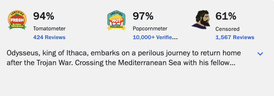

# Rotten Ketchup

A browser extension that adds an **Censored** ("Pull") score next to the Popcornmeter on Rotten Tomatoes movie pages, so the verified-ticket "push" bias behind the displayed score becomes visible.

As u/RoryTate discovered [here](https://www.reddit.com/r/KotakuInAction/comments/1v1ow9s/rotten_tomatoes_says_the_odyssey_has_a_97/), Rotten Tomatoes' Popcornmeter is sold as the audience score, but most of it is made up of "verified" ticket-buying votes that the site heavily weights and labels prominently. Rotten Ketchup adds a third column to the movie scorecard: The Censored score, computed from the unverified (non-ticket) votes that RT's verified-ticket scoring suppresses.

## Install

Rotten Ketchup is not listed on the Chrome Web Store. It is available for Firefox via the official Firefox Add-ons (AMO) page; for Chrome, Edge, Brave, and other Chromium-based browsers you can install it manually. Instructions for both are below.

### Firefox

Install from the official Firefox Add-ons listing:

Click "Add to Firefox" on the listing and confirm the permission prompt. The extension will start working immediately on any Rotten Tomatoes movie page.

If the AMO listing is unavailable, you can install it manually as a temporary add-on (see below).

### Chrome, Brave, Edge and other Chromium-based browsers

These browsers do not have a store listing for Rotten Ketchup, so the extension is installed by loading the unpacked folder directly. You only need to do this once; the extension stays installed until you remove it.

1. **Download the extension files.**
   - On the GitHub page for this repository, click the green **Code** button, then **Download ZIP**.
   - Save the ZIP anywhere on your computer (your Downloads folder is fine) and unzip it. You should now have a folder called `rotten-ketchup-master` (or similar) that contains a file named `manifest.json`. **Remember where this folder is located**, you will need to pick it in step 4.

2. **Open the extensions page in your browser.**
   - Chrome, Edge, or Brave: type `chrome://extensions` into the address bar and press Enter.
   - If you use Microsoft Edge, `edge://extensions` works the same way.

3. **Turn on Developer mode.**
   - Look for a toggle labeled **Developer mode** in the top-right corner of the extensions page. Switch it on. A row of new buttons (including **Load unpacked**) will appear.

4. **Load the extension.**
   - Click the **Load unpacked** button.
   - In the file picker, navigate to the folder you unzipped in step 1 and select it. (Pick the folder itself, not any file inside it.)
   - You should see "Rotten Ketchup" appear in your list of extensions with a small error-free card.

5. **Try it out.**
   - Open a Rotten Tomatoes movie page, for example <https://www.rottentomatoes.com/m/the_odyssey_2026>.
   - A third column labeled **Censored** should appear next to the Tomatometer and Popcornmeter at the top of the page.

**To update later:**

- When a new version of the extension is released, download the new release ZIP from the GitHub page and unzip it.
- Open the new folder, select all of its contents (`manifest.json`, `src/`, etc.), and copy them into your existing extension folder, overwriting the old files.
- Then go to `chrome://extensions`, click the **Reload** button on the Rotten Ketchup card.

**To uninstall:** go to `chrome://extensions`, click **Remove** on the Rotten Ketchup card, and confirm.

### Manual install in Firefox (fallback)

Use this only if the AMO listing is unavailable. This loads the extension as a temporary add-on that Firefox will remove when it restarts.

1. Download and unzip this repository (same as step 1 above).
2. Open `about:debugging#/runtime/this-firefox` in Firefox.
3. Click **Load Temporary Add-on…** and select the `manifest.json` file from inside the unzipped folder.
4. Open a Rotten Tomatoes movie page. The third column should appear.

You will need to repeat these steps after every Firefox restart until the AMO listing is available. Requires Firefox 109 or newer.

## What you should see

On any RT movie page, the scorecard now has three columns in its top row:

1. **Tomatometer** (critics)
2. **Popcornmeter** (verified-audience)
3. **Censored** (this extension, computed from unverified votes)

If a movie has no unverified votes yet, the third column shows `—` / `No independent votes yet` in muted text.

## Privacy

Rotten Ketchup only reads the public scorecard data already present in the page (the inline JSON at `#media-scorecard-json`) and renders an extra score column next to the existing Popcornmeter. It does not make any network requests, does not collect or transmit any data, and does not run on any site other than `rottentomatoes.com/m/*`.
